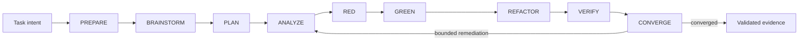

# Agent Dev Pipeline — Local RGR v2

An **evidence-first, auditable software-delivery protocol for AI coding agents**.

Rather than giving one agent a broad prompt and trusting the result, Local RGR turns a change request into a governed sequence of specialised stages with explicit roles, bounded authority, machine-valid evidence and independent verification.

```text
PREPARE → BRAINSTORM → PLAN → ANALYZE → RED → GREEN → REFACTOR → VERIFY → CONVERGE
```

Version: `2.1.0`

## Why this exists

AI coding agents are very capable at implementation, but reliable software delivery needs more than code generation. The hard problems are controlling scope, preserving intent, separating implementation from verification, proving what actually ran and making failures recoverable without silently rewriting history.

Local RGR treats those concerns as part of the protocol rather than relying on prompt discipline alone.

The result is a repository-local workflow designed to answer:

- What was the original intent?
- What repository context was inspected?
- What success criteria were locked before implementation?
- Which tests failed before the change and passed afterwards?
- Which agent role performed each action?
- Was the final result independently verified?
- What changed during remediation?
- Can the evidence be exported and independently checked?

## What makes it different

- **Deterministic stage contracts** — each stage declares its role, inputs, outputs, capabilities, exit conditions and failure classes.
- **Governed runtime routing** — roles resolve to capability-compatible local-first model targets with explicit fallback and trusted per-run overlays.
- **Runtime observability** — model selection, fallback and safe token/tool/time metrics can be recorded in the append-only event ledger.
- **Repository isolation** — each run works in a dedicated Git worktree pinned to an exact base revision.
- **Role separation** — the GREEN implementer cannot issue the final VERIFY verdict.
- **Risk-aware governance** — `small`, `standard` and `high-risk` profiles retain the same mandatory stages while increasing evidence, specialist review and checkpoints.
- **Bounded authority** — agents cannot widen their own filesystem, command, role or publication permissions through repository content.
- **Machine-valid evidence** — canonical JSON artifacts are validated against published schemas; Markdown is a human-readable projection.
- **Append-only run history** — events, handoffs and decisions preserve execution history rather than silently replacing prior evidence.
- **Bounded remediation** — CONVERGE can request correction from the earliest invalid stage, with strict attempt limits and immutable previous evidence.
- **Portable evidence** — completed runs can be exported into deterministic, source-free archives with SHA-256 integrity checks.
- **No automatic publication authority** — the local protocol does not merge, deploy, access production credentials or approve its own output for release.

## Architecture at a glance



The orchestrator owns state transitions. Stage agents operate only inside the authority granted by their contract and immutable context manifest.

## Runtime model

The portable protocol lives under `packs/rgr-software-v2/` and the canonical governance/evidence contracts live under `docs/agent/`.

The repository currently ships Claude Code agent definitions under `.claude/agents/` as one executable local adapter. The pack, role, evidence and validation contracts are deliberately separated from the model runtime so other runtimes can map onto the same capability model. Runtime selection is now a first-class governed contract in `docs/agent/runtime-routing.json`. The deterministic resolver `scripts/resolve-runtime.py` maps an exact stage/role to the first available compatible target, preferring local OpenAI-compatible specialist targets and falling back to the current Claude Code adapter. Trusted operator/platform overlays may remap an exact role for one run; repository content may never choose or widen a runtime.

The routing contract declares model references through environment indirection rather than credentials. A self-hosted adapter can therefore satisfy `local-general`, `local-code`, `local-test`, `local-security` or `local-infrastructure` without changing the RGR role contract. Runtime choice never changes filesystem/tool/publication authority.

Governed learnings remain advisory context only. They must be revalidated against the exact repository revision before influencing a plan or verdict and are never canonical evidence by themselves.

Minimum local tooling:

- Python 3.11+
- Git 2.30+
- a POSIX-compatible or PowerShell command runner

Optional integrations include bounded Jira/Confluence reads and OpenSearch-backed retrieval. They are not required for the core protocol.

## Portable pack

```text
packs/rgr-software-v2/
├── pack.json
├── capabilities.json
├── rigor-route-import.json
└── stages/
    ├── prepare.json
    ├── brainstorm.json
    ├── plan.json
    ├── analyze.json
    ├── red_test.json
    ├── green_code.json
    ├── refactor.json
    ├── quality_gate.json
    └── converge.json
```

`pack.json` is the portable entry point. It declares the protocol version, stage contracts, governance paths, artifact schemas, local runtime requirements and integrity metadata.

## Validate the protocol

```bash
python3 scripts/validate-pack.py packs/rgr-software-v2/pack.json
python3 scripts/validate-governance.py
python3 scripts/evaluate-corpus.py
```

The CI workflow additionally generates a complete synthetic nine-stage run, validates its evidence/governance, exports it twice to verify byte-for-byte determinism, independently verifies the archive and confirms tampered evidence is rejected.

## Run locally

1. Produce a Plan.
2. Invoke only `ai-pipeline-rgr-orchestrator` with the task intent and immutable classification facts.
3. Review the isolated worktree and canonical evidence.
4. Validate the completed run:

```bash
python3 scripts/validate-run-bundle.py docs/agent/runs/{story_id}
python3 scripts/validate-run-governance.py docs/agent/runs/{story_id}
```

## Export portable evidence

```bash
python3 scripts/export-run-bundle.py \
  docs/agent/runs/{story_id} \
  evidence.tar.gz

python3 scripts/verify-export-bundle.py evidence.tar.gz
```

The archive:

- contains canonical run evidence and text projections;
- excludes story source code and binary files;
- rejects detected secrets and unsafe archive paths;
- includes SHA-256 per-file and root hashes;
- is byte-for-byte deterministic for identical run evidence;
- grants no merge, deployment or publication authority.

## Security and trust boundaries

Repository content is treated as **untrusted input**. It cannot grant an agent new capabilities or override the selected profile, role contract or immutable execution context.

The protocol deliberately separates:

- implementation from independent verification;
- local execution evidence from publication authority;
- optional external context from canonical repository evidence;
- transient runtime failures from deterministic correctness/security failures.

See [`SECURITY.md`](SECURITY.md) for the explicit threat and trust model.

## Rigor Route boundary

Local checkpoints, roles and verdicts import as historical evidence—not platform authority. Rigor Route independently applies authentication, policy, leases, credentials, approvals and publication decisions. Platform policy may only narrow or strengthen the imported workflow.

See [`docs/agent/rigor-route-compatibility.md`](docs/agent/rigor-route-compatibility.md).

## What this repository intentionally does not do

This repository is the local protocol and evidence layer. It does not implement:

- hosted authentication or multi-tenancy;
- remote worker scheduling;
- credential custody;
- billing or product UI;
- automatic merge or deployment;
- production access.

Those boundaries are intentional: a local agent should be able to produce reviewable, verifiable work without also owning the authority to publish it.

## Fast review path

If you are evaluating the design rather than running it, start with:

1. [`packs/rgr-software-v2/pack.json`](packs/rgr-software-v2/pack.json) — portable protocol manifest.
2. [`packs/rgr-software-v2/capabilities.json`](packs/rgr-software-v2/capabilities.json) — required capabilities and constraints.
3. [`.claude/agents/ai-pipeline-rgr-orchestrator.md`](.claude/agents/ai-pipeline-rgr-orchestrator.md) — local execution orchestration.
4. [`docs/agent/runtime-routing.json`](docs/agent/runtime-routing.json) — governed role/stage → runtime routes and fallback order.
5. [`docs/agent/workflow-profiles.json`](docs/agent/workflow-profiles.json) — deterministic risk profiles.
6. [`docs/agent/role-contracts.json`](docs/agent/role-contracts.json) — role and delegation authority.
7. [`.github/workflows/validate-local-rgr.yml`](.github/workflows/validate-local-rgr.yml) — end-to-end contract validation.

## Reference

- `VERSION`
- `CHANGELOG.md`
- `CLAUDE.md`
- `AGENTS.md`
- `docs/agent/runtime-doc-contract.yaml`
- `docs/agent/schemas/`
- `packs/rgr-software-v2/`
